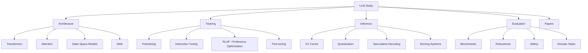

# LLM Study Notes

This folder collects notes on large language models, efficient training, model architecture, evaluation, and deployment.

## Study Map



## Core Concepts

| Topic | Short Note | Status |
|---|---|---|
| Transformer | Self-attention-based sequence model architecture. | To study |
| Exact attention | Standard softmax attention computed without approximation. | To study |
| IO-aware attention | Exact attention implemented to reduce GPU memory movement, such as FlashAttention. | To study |
| Fine-tuning | Adapting a pretrained model to a task or domain. | To study |
| Quantization | Reducing numerical precision to save memory and speed inference. | To study |

## Paper Notes

Use this format for each paper:

```text
### Paper Title

- Problem:
- Main idea:
- Method:
- Key result:
- Limitation:
- Why it matters:
```

## Implementation Notes

```text
Date:
Model:
Dataset:
Goal:
Command / code:
Result:
Problem:
Next step:
```

## Questions To Revisit

- What is the difference between exact attention, sparse attention, and linear attention?
- When is fine-tuning better than retrieval-augmented generation?
- Which acceleration methods preserve model quality best?

